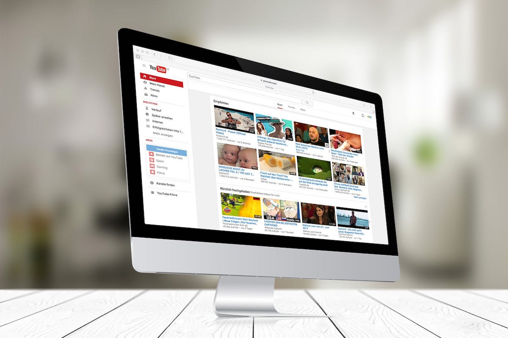

<div class="ui small rounded images">
  
</div>

auto-playlist is a python script designed as a webscraper to pull YouTube video URLs from a given YouTube channel URL.

The script parses the 'href' sources in a HTML page and copy's them to a .txt file. The original intention of the script was to be able to automatically create a youtube playlist within a users account with the scraped URLs. However the YouTube API only allows the creation of a blank playlist. To get around this the script is also able to log into a users YouTube account using the YouTube API. Once logged in, it is possible to access a boolean condition controlling the ability to add the current video to a playlist. The program is able to index through the copied list of URL's and then add them one at a time to the users most recent playlist which is able to be created through the YouTube API.

The script is written in python 3 and primarily uses the Beatiful Soup library in conjunction with the YouTube API.
As this can be fairly memory heavy, the program is set to add the first 10 URL's to the playlist.

Below is an example of parsing a given YouTube channel URL and scraping the links into a .txt file.
```
{
  url=(channelName)
  url='https://www.youtube.com/user/fireflies2781996'
  print("done...")

  print("Opening URL...")
  html=urllib2.urlopen(url)
  print("done...")

  print("Parsing URL")
  response=html.read()
  newSoup=BeautifulSoup(response,"html.parser")
  print("done...")

  print("Collecting links...")
  yt_links=newSoup.find_all("a", class_="yt-uix-tile-link")
  print("done...")

  print("Writing to file...please wait")
}
```

You can learn more at the Beautiful soup library:[https://www.crummy.com/software/BeautifulSoup/bs4/doc/](https://www.crummy.com/software/BeautifulSoup/bs4/doc/).

YouTube API developer website:[https://developers.google.com/youtube/](https://developers.google.com/youtube/)


source:[https://github.com/nicolas-lum/auto-playlist](https://github.com/nicolas-lum/auto-playlist)
